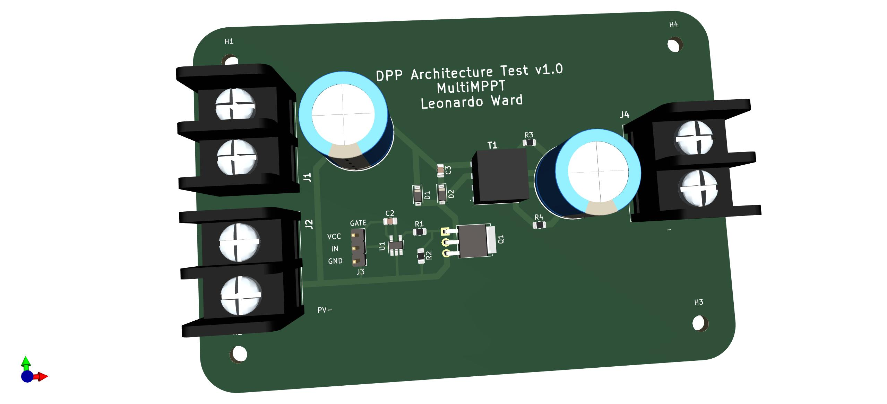
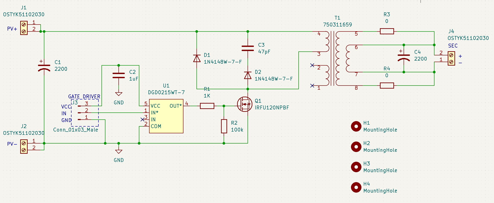
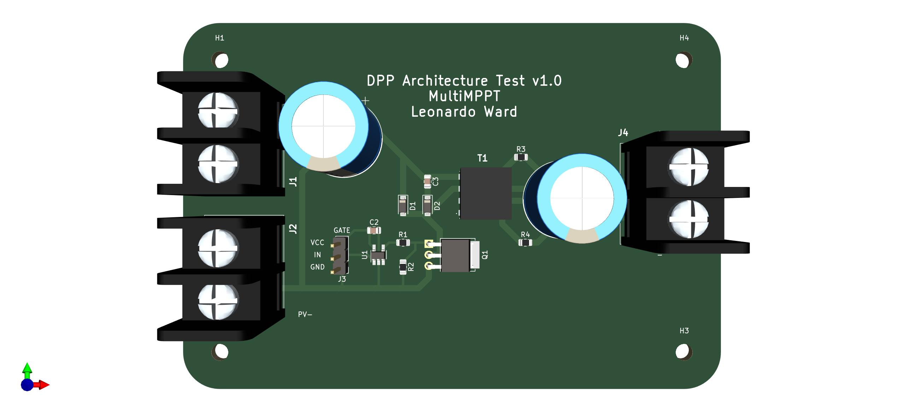
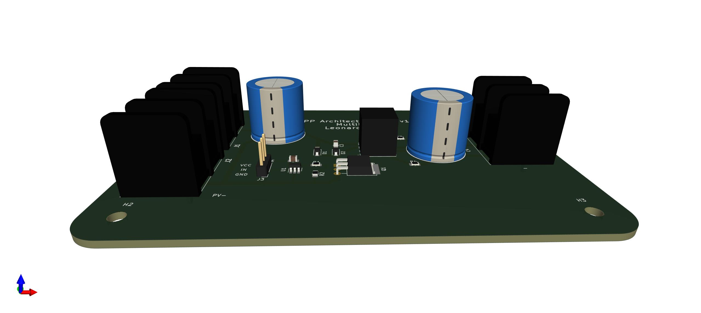
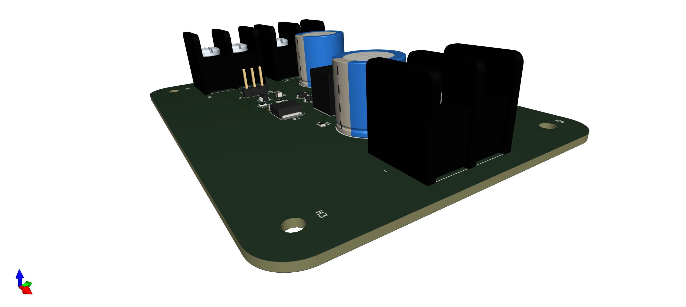

# DPP Architecture Test Board v1.0

<p align="center">
  
</p>

A single‑channel **isolated flyback power stage** on a KiCad 6 PCB, built to bench‑test
the converter used in a **Differential Power Processing (DPP)** MPPT. It is the hardware
side of the [**MultiMPPT**](https://hackaday.io/project/185092-multimppt) project &mdash; a
low‑cost, high‑efficiency MPPT with multiple independent inputs &mdash; and it implements
one converter cell from the model in
[`dpp-mppt-simulation`](https://github.com/leonardoward/dpp-mppt-simulation).

## Table of Contents

1. [What It Is](#what-it-is)
2. [How the Circuit Works](#how-the-circuit-works)
3. [Schematic](#schematic)
4. [Connectors](#connectors)
5. [Bill of Materials](#bill-of-materials)
6. [PCB](#pcb)
7. [Building the Board](#building-the-board)
8. [Repository Layout](#repository-layout)
9. [Notes & Safety](#notes--safety)
10. [License](#license)

## What It Is

In a DPP MPPT the PV modules stay in series to feed the load, and a small converter
across each module handles only the **difference** in current needed to hold that
module at its own maximum power point. This board is **one** of those converters,
broken out on its own so it can be driven, loaded and measured in isolation:

* PV / module side on `J1`, `J2`.
* String / bus side on `J4`, galvanically isolated through the transformer.
* The switching MOSFET is driven by an **external** controller (a microcontroller or a
  bench signal generator) through the 3‑pin gate‑driver header `J3` &mdash; there is no
  control loop, no sensing and no microcontroller on the board itself.

## How the Circuit Works

It is a classic isolated **flyback** converter:

1. **Input** &mdash; the module connects to `J1`/`J2`; `C1` (2200&nbsp;&micro;F) is the input
   bulk capacitor that holds the module voltage steady over a switching cycle.
2. **Switch** &mdash; `Q1` (IRFU120N N‑channel MOSFET) chops the current through the
   transformer primary. While `Q1` is on, energy is stored in the transformer core;
   when it turns off, that energy is delivered to the secondary.
3. **Gate drive** &mdash; the PWM signal enters on `J3` and is buffered by `U1`
   (DGD0215 gate driver) so the MOSFET can be switched cleanly at high frequency.
   `C2` (1&nbsp;&micro;F) decouples the driver, `R1` (1&nbsp;k) is the gate resistor and
   `R2` (100&nbsp;k) is the gate pull‑down that keeps `Q1` off when the drive is absent.
4. **Snubber / clamp** &mdash; `D1`, `D2` (1N4148W) with `C3` (47&nbsp;pF) form the
   protection network across the primary that absorbs the leakage‑inductance spike at
   turn‑off. The design allows populating either `D2 + C3` **or** `D1` alone.
5. **Transformer** &mdash; `T1` is a Würth **750311659** flyback transformer
   (180&nbsp;kHz, 1500&nbsp;Vrms primary‑to‑secondary isolation), which both transfers
   the energy and provides the galvanic isolation the DPP architecture needs.
6. **Output** &mdash; `C4` (2200&nbsp;&micro;F) filters the secondary and the converter
   output is brought out on `J4`. `R3`, `R4` are 0&nbsp;&Omega; jumpers / current‑sense
   footprints in the secondary return.

## Schematic

<p align="center">
  
</p>

The full schematic is also in [`Schematic.pdf`](Schematic.pdf).

## Connectors

| Ref | Type | Purpose |
| --- | ---- | ------- |
| `J1` | Barrier terminal block | `PV+` &mdash; module positive |
| `J2` | Barrier terminal block | `PV-` &mdash; module negative |
| `J3` | 3‑pin 0.1" header | Gate drive from the external controller: `VCC`, `IN`, `GND` |
| `J4` | Barrier terminal block | `SEC` &mdash; isolated secondary / string‑bus connection |
| `H1`&ndash;`H4` | Mounting holes | &mdash; |

## Bill of Materials

| Reference | Part | Qty |
| --------- | ---- | --- |
| PCB | 2‑layer, [JLCPCB](https://jlcpcb.com/) | 1 |
| C1, C4 | 2200&nbsp;&micro;F 50&nbsp;V aluminium electrolytic, radial ([228CKS050MQW](https://www.digikey.com/en/products/detail/cornell-dubilier-illinois-capacitor/228CKS050MQW/5411846)) | 2 |
| C2 | 1&nbsp;&micro;F 25&nbsp;V X7R 0805 ([CL21B105KAFNNNE](https://www.digikey.com/en/products/detail/samsung-electro-mechanics/CL21B105KAFNNNE/3886724)) | 1 |
| C3 | 47&nbsp;pF 100&nbsp;V C0G/NP0 0805 ([08051A470JAT2A](https://www.digikey.com/en/products/detail/kyocera-avx/08051A470JAT2A/563392)) | 1 |
| D1, D2 | 100&nbsp;V 300&nbsp;mA SOD‑123 diode, 1N4148W ([1N4148W-7-F](https://www.digikey.com/en/products/detail/diodes-incorporated/1N4148W-7-F/814371)) | 2 |
| J1, J2, J4 | 9.50&nbsp;mm 2‑circuit barrier block ([OSTYK51102030](https://www.digikey.com/en/products/detail/on-shore-technology-inc/OSTYK51102030/1588818)) | 3 |
| Q1 | N‑channel 100&nbsp;V 9.4&nbsp;A IPAK / TO‑251, IRFU120N ([IRFU120NPBF](https://www.digikey.com/en/products/detail/infineon-technologies/IRFU120NPBF/812395)) | 1 |
| R1 | 1&nbsp;k&Omega; 1% 0805 ([RMCF0805FT1K00](https://www.digikey.com/en/products/detail/stackpole-electronics-inc/RMCF0805FT1K00/1760090)) | 1 |
| R2 | 100&nbsp;k&Omega; 1% 0805 ([RMCF0805FG100K](https://www.digikey.com/en/products/detail/stackpole-electronics-inc/RMCF0805FG100K/1712614)) | 1 |
| R3, R4 | 0&nbsp;&Omega; jumper 0805 ([RC0805JR-070RL](https://www.digikey.com/en/products/detail/yageo/RC0805JR-070RL/728216)) | 2 |
| T1 | Flyback transformer, 180&nbsp;kHz, 1500&nbsp;Vrms isolation, SMT ([750311659](https://www.digikey.com/en/products/detail/w%C3%BCrth-elektronik/750311659/4800066)) | 1 |
| U1 | Low‑side gate driver, inverting / non‑inverting, TSOT‑25 ([DGD0215WT-7](https://www.digikey.com/en/products/detail/diodes-incorporated/DGD0215WT-7/10130661)) | 1 |

A machine‑readable BOM is in [`dpp-architecture/dpp-architecture.csv`](dpp-architecture/dpp-architecture.csv).

## PCB

<p align="center">
  
</p>

<p align="center">
  
  
</p>

## Building the Board

* **Design files** &mdash; open `dpp-architecture/dpp-architecture.kicad_pro` in
  **KiCad 6** or newer. Project‑local symbol, footprint and 3D‑model libraries are
  under `dpp-architecture/Symbols/`, `dpp-architecture/Footprints/` and
  `dpp-architecture/3D/`.
* **Fabrication** &mdash; ready‑to‑send Gerbers and drill files are in
  `dpp-architecture/Gerber/` (and zipped as `dpp-architecture/Gerber.zip`); a step
  model of the assembly is in `dpp-architecture/Exports/`.

## Repository Layout

```
README.md                          this file
LICENSE                            GPL v3.0
Schematic.pdf                      exported schematic
Images/                            3D renders + schematic image for this README
dpp-architecture/
  dpp-architecture.kicad_pro/_sch/_pcb   KiCad 6 project
  dpp-architecture.csv               BOM
  Symbols/ Footprints/ 3D/           project-local libraries
  Gerber/  Gerber.zip                fabrication output
  Exports/                           STEP model of the board
  dpp-architecture-backups/          KiCad auto-save archive
```

## Notes & Safety

* This is a **v1.0 test fixture**, not a finished product: it exercises the power
  stage only. Closing the MPPT loop (sensing, duty‑cycle control) is done off‑board.
* The gate‑driver header exposes the drive rail; keep the external controller's ground
  common with `J3` `GND`.
* Electrolytic capacitors on both sides store charge &mdash; allow them to discharge
  before handling.
* The `dpp-architecture-backups/` folder is KiCad's auto‑save archive and is only kept
  for history; the working files are the ones directly under `dpp-architecture/`.

## License

Released under the **GNU General Public License v3.0** &mdash; see [`LICENSE`](LICENSE).
