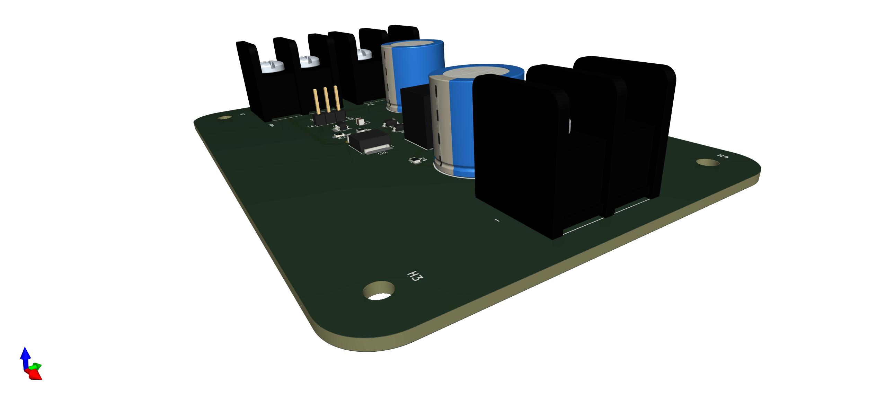

# DPP Architecture Test v1.0

  

This PCB was design to test the DPP architecture used in MPPT designs. The software used to designed the PCB is Kicad 6.

The tests performed with this PCB will contribute to develop the project MultiMPPT, that is a low cost high efficiency MPPT with multiple inputs. For more information about the project check the following [link](https://hackaday.io/project/185092-multimppt).

## Table of Contents

1. [Hardware Design](#hardware-design)
2. [PCB](#pcb)
3. [Bill of Materials](#bill-of-materials)

## Hardware Design

The following image contains the schematic of the PCB:

  

Where:

- J1, J2 and J3 are used to connect the solar panel and connect to other components inside the MPPT (during the tests).
- T1, C1, C4, Q1, R1 and R2 are the main components of the Flyback Converter.
- D1, D2 and C3 create a snubber circuit to protect Q1. There will be used D2 + C3 or D1.
- U1 and C2 is a gate driver to facilitate the change of state of Q1 at high frequencies (controlled using a microncontroller connected to the board).
- J3 is a connector to give access to the gate driver.

**[Back to top](#table-of-contents)**

## PCB

  

  

  

**[Back to top](#table-of-contents)**

## Bill of Materials

| Reference | Quantity |
| ------------- | ------------- |
| [PCB](https://www.pcbway.com/)  | 1 |
| [2200µF 50V Aluminum Electrolytic Capacitors Radial](https://www.digikey.com/en/products/detail/cornell-dubilier-illinois-capacitor/228CKS050MQW/5411846?s=N4IgTCBcDa5gHAYQNIGUAMBWdBZAigOoC0AcgCIgC6AvkA)  | 2 |
| [1µF ±10% 25V Ceramic Capacitor X7R 0805](https://www.digikey.com/en/products/detail/samsung-electro-mechanics/CL21B105KAFNNNE/3886724)  | 1 |
| [47pF ±5% 100V Ceramic Capacitor C0G, NP0 0805](https://www.digikey.com/en/products/detail/kyocera-avx/08051A470JAT2A/563392)  | 1 |
| [Diode Standard 100V 300mA (DC) SOD-123 1N4148W](https://www.digikey.com/en/products/detail/diodes-incorporated/1N4148W-7-F/814371)  | 2 |
| [2 Circuit 0.374" (9.50mm) Barrier Block Connector Screws with Captive Plate](https://www.digikey.com/en/products/detail/on-shore-technology-inc/OSTYK51102030/1588818)  | 3 |
| [N-Channel 100 V 9.4A (Tc) 48W (Tc) Through Hole IPAK (TO-251AA) IRFU120NPBF](https://www.digikey.com/en/products/detail/infineon-technologies/IRFU120NPBF/812395)  | 1 |
| [1 kOhms ±1% 0.125W, 1/8W Chip Resistor 0805](https://www.digikey.com/en/products/detail/stackpole-electronics-inc/RMCF0805FT1K00/1760090)  | 1 |
| [100 kOhms ±1% 0.125W, 1/8W Chip Resistor 0805](https://www.digikey.com/en/products/detail/stackpole-electronics-inc/RMCF0805FG100K/1712614)  | 1 |
| [0 Ohms Jumper 0.125W, 1/8W Chip Resistor 0805](https://www.digikey.com/en/products/detail/yageo/RC0805JR-070RL/728216)  | 2 |
| [Flyback Converters For For DC/DC Converters SMPS Transformer 1500Vrms Isolation 180kHz Surface Mount](https://www.digikey.com/en/products/detail/w%C3%BCrth-elektronik/750311659/4800066)  | 1 |
| [Low-Side Gate Driver IC Inverting, Non-Inverting TSOT-25 (Type TH)](https://www.digikey.com/en/products/detail/diodes-incorporated/DGD0215WT-7/10130661)  | 1 |

**[Back to top](#table-of-contents)**
